

# Dev_Setup
Setup Development Environment

#Assignment: Setting Up Your Developer Environment

#Objective:
This assignment aims to familiarize you with the tools and configurations necessary to set up an efficient developer environment for software engineering projects. Completing this assignment will give you the skills required to set up a robust and productive workspace conducive to coding, debugging, version control, and collaboration.

#Tasks:

1. Select Your Operating System (OS):
   Choose an operating system that best suits your preferences and project requirements. Download and Install Windows 11. https://www.microsoft.com/software-download/windows11
   1.	First confirm system requirements, if your PC meets the requirements then proceed to
   2.	Download windows 11
first visit the official Microsoft website to download the windows operating system:(https://www.microsoft.com/software-download/windows11)
Download windows 11 Installation Assistant
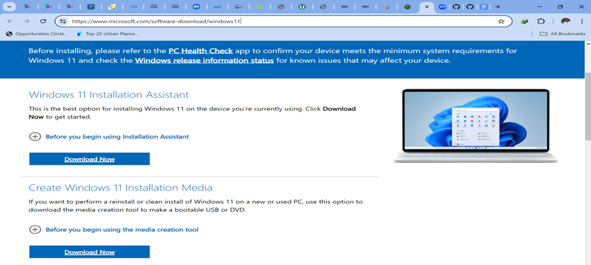
   3.	Download Tool: Click on ‘Download Now’ under the ‘Windows 11 Installation Assistant’ section.
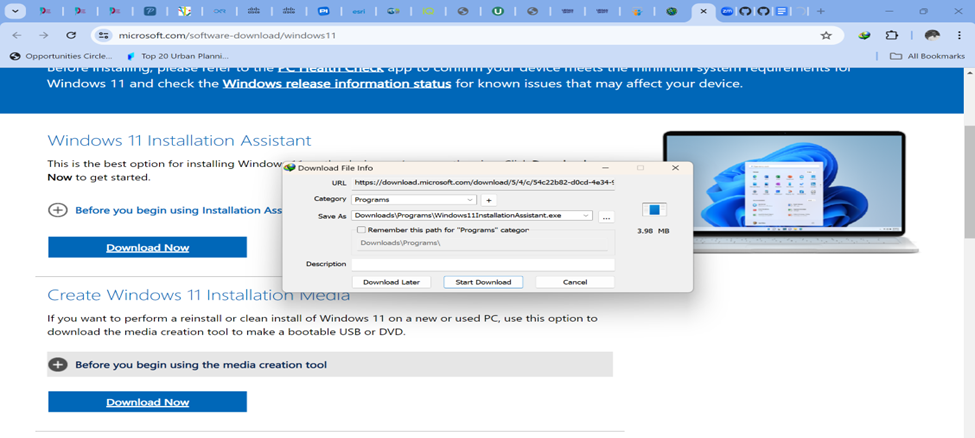
   4.	Backup Your Data. Before installation, it is important to back up your files to avoid data loss during the installation process
   5.	Run Installation Assistant: Open the tool and follow the on-screen instructions including selecting installation type, disc partitioning.
   6.	I skipped the installation process since I already have windows 11 installed on my PC.
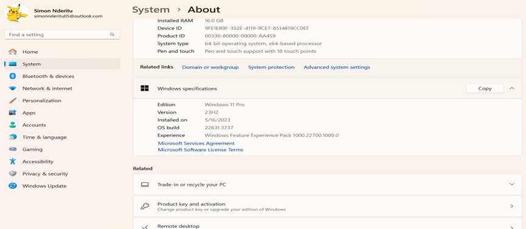
   7.	After successful installation, configure your user account, regional settings, and privacy setting and performing needed updates.

2. Install a Text Editor or Integrated Development Environment (IDE):
   Select and install a text editor or IDE suitable for your programming languages and workflow. Download and Install Visual Studio Code. https://code.visualstudio.com/Download
   1.	to download visit Visual Studio Code download page and download the version that fits your operating systems architecture for my case(X64) (https://code.visualstudio.com/Download)
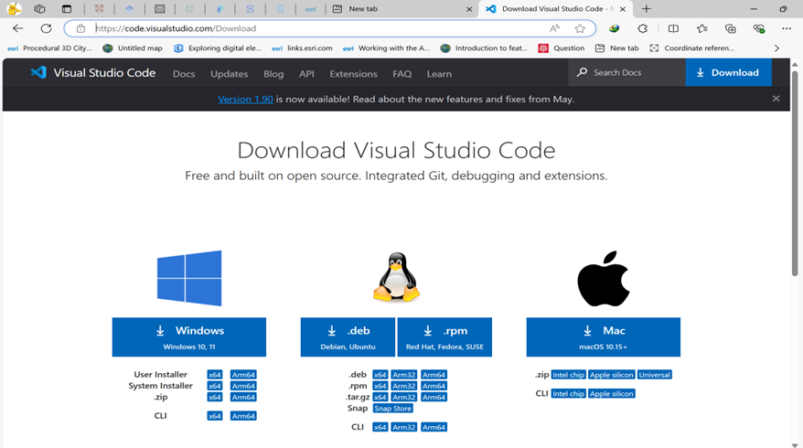
   2.	After downloading, right click and select run as administrator and follow the installation steps as prompted.
   3.	Proceed to environment variable and add path 
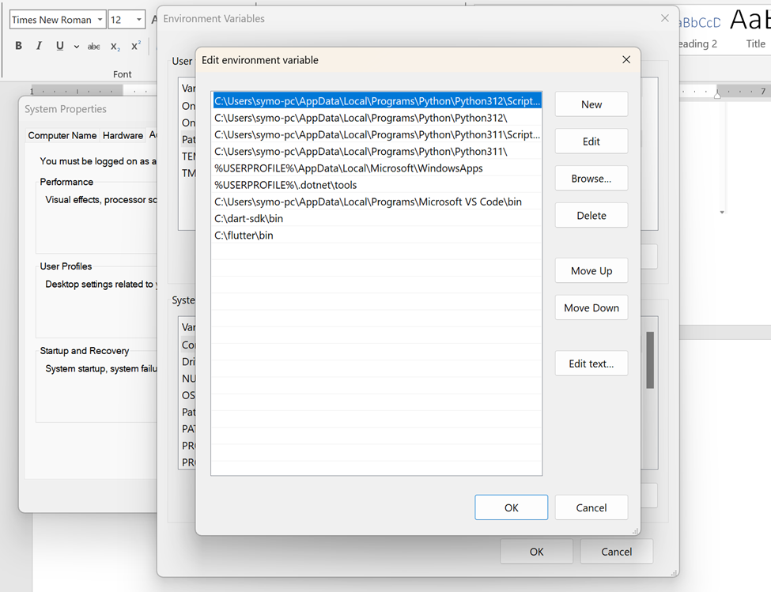
   4.	Lauch VS code and install the necessary extensions such as python, SQL, Dart, and flutter
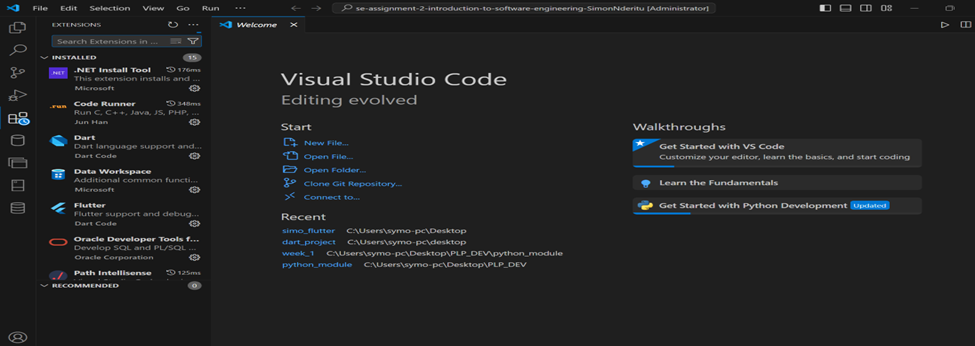

3. Set Up Version Control System:
   Install Git and configure it on your local machine. Create a GitHub account for hosting your repositories. Initialize a Git repository for your project and make your first commit. https://github.com
   1.	Git installation 
   Proceed to the official website and Download Git https://git-scm.com/download/win. 
Run the installer and follow the setup instructions, choosing your preferred options for default editor, and other settings.
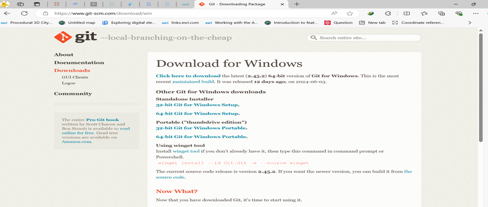
   2.	Create a GitHub account.
Proceed to GitHub official website and signup for an account, otherwise proceed to sign in if you already have an account (https://github.com/) 
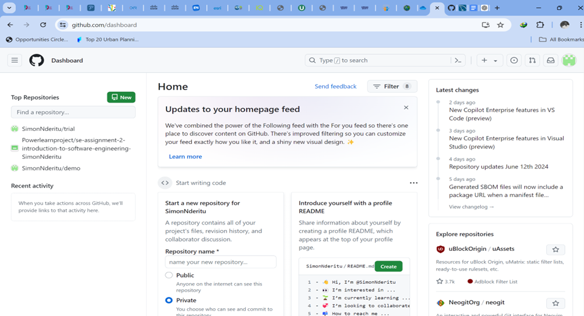
GitHub configuration confirmation
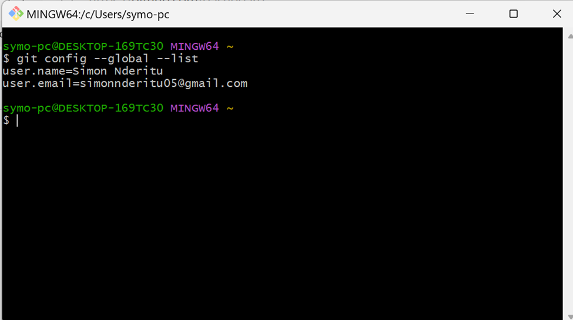
   3.	Make the first commit.
Open Git Bash 
   - Navigate to your project directory or create a new one:
 	mkdir my_project
 	cd my_project
 
   Initialize a Git repository:
 	git init
 
   - Create a README file:
 
 	echo "# My Project" >> README.md
 	
   - Add the README file to the staging area:
 	
 	git add README.md
   - Commit the changes: 
 	git commit -m "This is first commit"
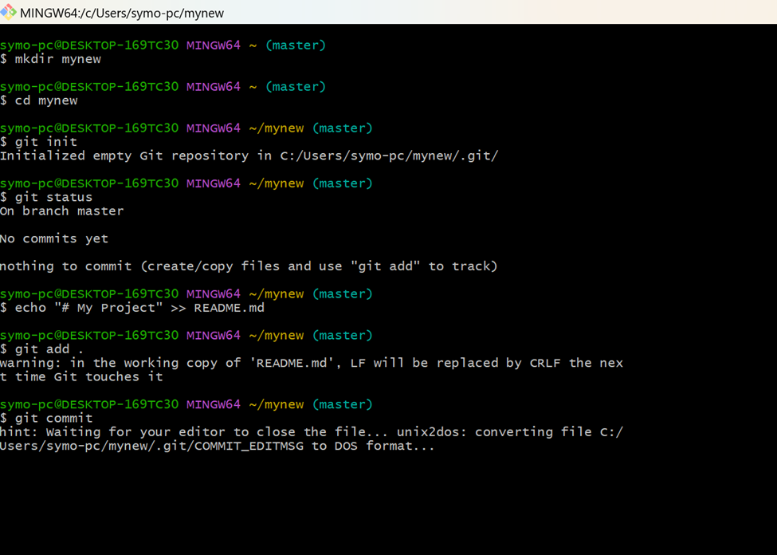

4. Install Necessary Programming Languages and Runtimes:
  Instal Python from http://wwww.python.org programming language required for your project and install their respective compilers, interpreters, or runtimes. Ensure you have the necessary tools to build and execute your code.
   1.	To download python, go to official python website and select the latest version for your operating system (https://www.python.org/) 
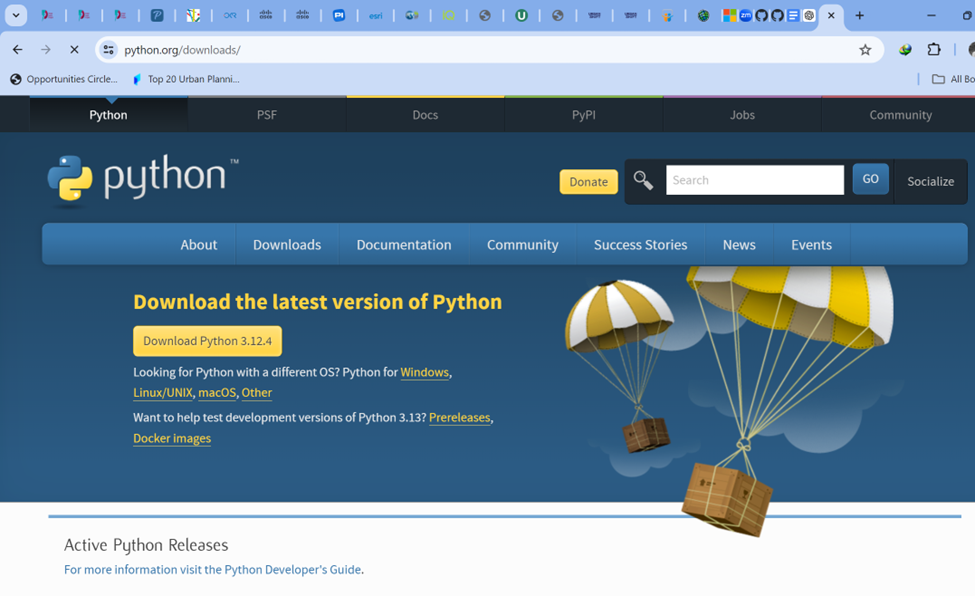
   2.	Installation 
Double click on the installer and select run as administrator and follow the installation prompts, ensure you check the option of add Python to PATH.
   3.	Confirm for successful installation
Open git bas or command prompt 
python –version
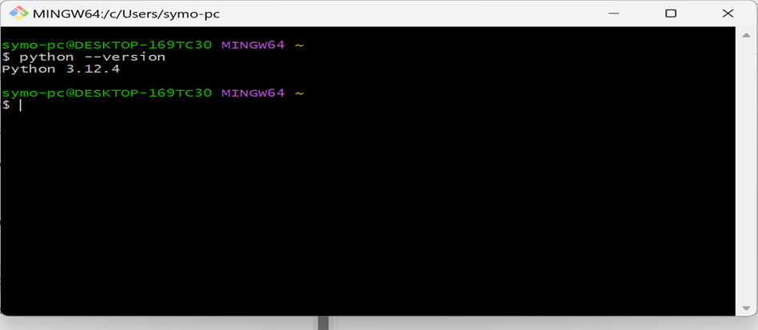

5. Install Package Managers:
   If applicable, install package managers like pip (Python).
   1.	To install pip use the command  Python get- pip.py
   2.	Open git bash and run
Pip –version
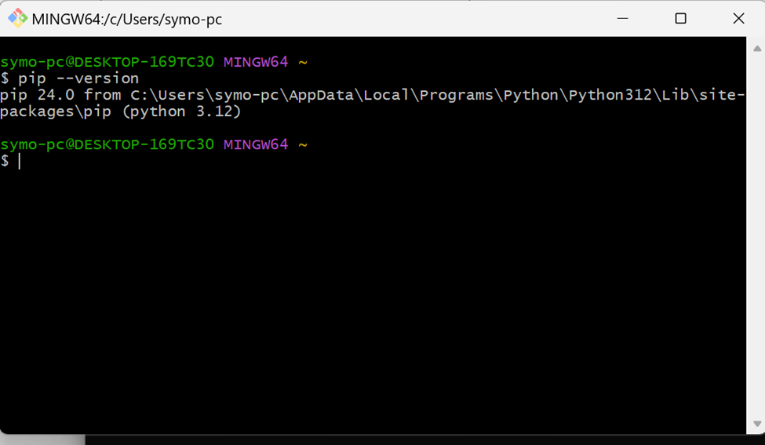

6. Configure a Database (MySQL):
   Download and install MySQL database. https://dev.mysql.com/downloads/windows/installer/5.7.html
   1.	To download MySQL visit MySQL website (https://dev.mysql.com/downloads/windows/installer/5.7.html).
Select the latest version and choose the installer that fits your operating system architecture 
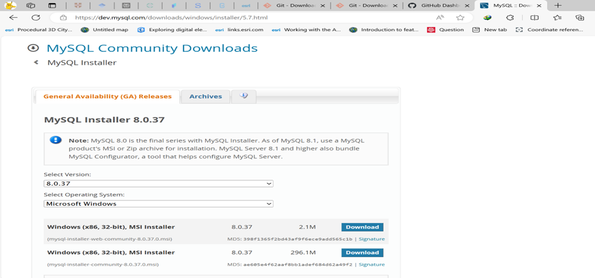
   2.	Installation Process:
   	Run the downloaded MySQL Installer and follow the setup prompts.
Ensure you choose the setup type (e.g., Developer Default) and Configure MySQL Server settings, including setting up root password.
   3.	Verify for successful installation by opening the MYSQL workbench using your root password

7. Set Up Development Environments and Virtualization (Optional):
   Consider using virtualization tools like Docker or virtual machines to isolate project dependencies and ensure consistent environments across different machines.
   1.	To download Docker, visit docker website (https://www.docker.com/products/docker-desktop/) 
   2.	 Click the installer and follow the installation prompts.
   3.	Verify for successful installation via git bash
Docker -–version

OPTED NOT TO INSTALL.

8. Explore Extensions and Plugins:
   Explore available extensions, plugins, and add-ons for your chosen text editor or IDE to enhance functionality, such as syntax highlighting, linting, code formatting, and version control integration.
   1.	To install extension, open VS code
   2.	Select extension option and search the extension needed and then choose install.
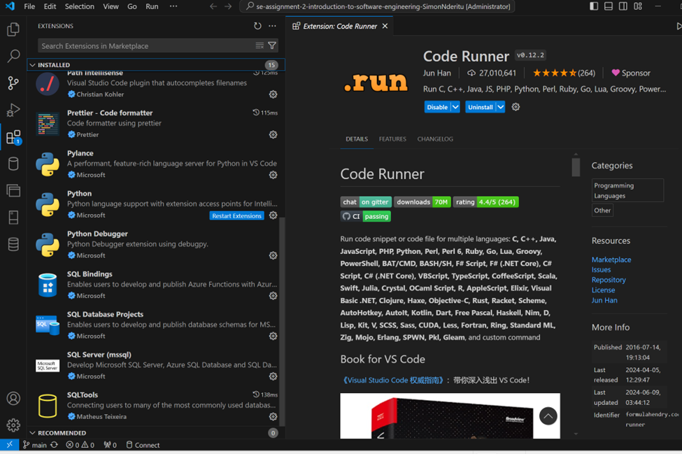

9. Document Your Setup:
    Create a comprehensive document outlining the steps you've taken to set up your developer environment. Include any configurations, customizations, or troubleshooting steps encountered during the process. 
   9.	challenges faced during setup and strategies employed to overcome them.
Challenges 
   1.	Setting up MySQL posed challenges but took initiative to follow the step-by-step installation recording as well as the website documentation.

#Deliverables:
- Document detailing the setup process with step-by-step instructions and screenshots where necessary.
- A GitHub repository containing a sample project initialized with Git and any necessary configuration files (e.g., .gitignore).
- A reflection on the challenges faced during setup and strategies employed to overcome them.

#Submission:
Submit your document and GitHub repository link through the designated platform or email to the instructor by the specified deadline.

#Evaluation Criteria:**
- Completeness and accuracy of setup documentation.
- Effectiveness of version control implementation.
- Appropriateness of tools selected for the project requirements.
- Clarity of reflection on challenges and solutions encountered.
- Adherence to submission guidelines and deadlines.

Note: Feel free to reach out for clarification or assistance with any aspect of the assignment.
